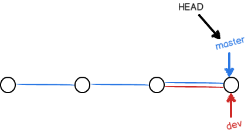
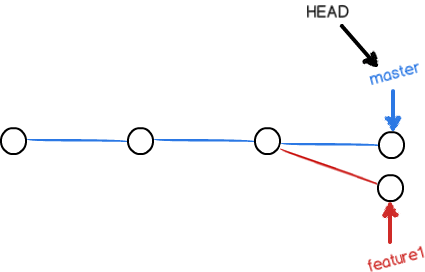

### Intro

**git是**：Git是目前世界上最先进的分布式版本控制系统，能记录每次文件的改动。

**创建版本库：** 新建项目文件夹，在文件夹内 `git init`

**把文件添加到版本库：**

> 所有的版本控制系统，其实只能跟踪文本文件的改动，比如TXT文件，网页，所有的程序代码等等，Git也不例外。版本控制系统可以告诉你每次的改动，比如在第5行加了一个单词“Linux”，在第8行删了一个单词“Windows”。而图片、视频这些二进制文件，虽然也能由版本控制系统管理，但没法跟踪文件的变化，只能把二进制文件每次改动串起来，也就是只知道图片从100KB改成了120KB，但到底改了啥，版本控制系统不知道，也没法知道。

`git add <filename>`告诉`Git`把文件添加到仓库，`git commit`告诉`Git`把文件提交到仓库。`git commit -m <message>`,`-m`选项可添加本次提交的说明。

### 版本控制

**版本回退**

`git status`命令可以让我们时刻掌握仓库当前的状态

`git diff`这个命令能看看具体修改了什么内容，

> 1. -开头的行，是只出现在版本库中的行
> 2. +开头的行，是只出现在工作区中的行
> 3. 空格开头的行，是源文件和目标文件中都出现的行

`git log`命令显示从最近到最远的提交日志，输出的内容有`commit id`、`Author`、`Date`，以及`git commit`时输入的`<message>` 。如果嫌输出信息太多，可以加上`--pretty=oneline`参数，这时每次提交的记录只会输出一行，且只包括`commit id`和`<message>`

<u>版本回退</u>：在Git中，用`HEAD`表示当前版本，也就是最新的提交。上一个版本就是`HEAD^`，上上一个版本就是`HEAD^^`，当然往上100个版本写100个`^`比较容易数不过来，所以写成`HEAD~100`。回退到上一个版本，就可以使用`git reset`命令。

```
git reset --hard HEAD^
```

这个时候如果后悔了，只要当前的命令行窗口还没有关，找到那个之前版本的`commit id`（只需要前几位就好），就可以指定回到未来的某个版本。

```
git reset --hard <commit-id>
```

如果命令行窗口也关了，可以使用`git reflog`命令，`git reflog`记录了你的每一次命令。

`git log`查看的是提交历史，`git reflog`查看的是命令历史。

**工作区和暂存区**


<u>工作区：</u> 使用git管理的项目文件夹下除`.git`文件，所有能够修改被`git`追踪的文件都算在工作区里。

<u>版本库：</u> `.git`，这个不算工作区，而是Git的版本库。里存了很多东西，其中最重要的就是称为stage（或者叫index）的暂存区，还有Git为我们自动创建的第一个分支`master`，以及指向`master`的一个指针叫`HEAD`。

把文件往Git版本库里添加的时候，是分两步执行的：

第一步是用`git add`把文件添加进去，实际上就是把文件修改添加到暂存区；

第二步是用`git commit`提交更改，实际上就是把暂存区的所有内容提交到当前分支。

`git add`命令实际上就是把要提交的所有修改放到暂存区（Stage）

> `git add`可以用来跟踪新文件，或者把已跟踪的文件放到暂存区，还能用于合并时把有冲突的文件标记为已解决状态等。 将这个命令理解为“精确地将内容添加到下一次提交中”而不是“将一个文件添加到项目中”要更加合适。 

然后，执行`git commit`就可以一次性把暂存区的所有修改提交到分支。

**管理修改**

每一次修改后都要add到暂存区(staged)，然后`commit`到分支上。

**撤销修改**

<u>修改还未添加到暂存区：</u>

命令`git checkout -- <filename>`意思就是，把`<filename>`文件在工作区的修改全部撤销，这里有两种情况：

> `git checkout`其实是用版本库里的版本替换工作区的版本，无论工作区是修改还是删除，都可以“一键还原”。

一种是`<fliename>`自修改后还没有被放到暂存区，现在，撤销修改就回到和版本库一模一样的状态；

一种是`<fileneme>`已经添加到暂存区后，又作了修改，现在，撤销修改就回到添加到暂存区后的状态。

总之，就是让这个文件回到最近一次`git commit`或`git add`时的状态。

<u>修改已经添加到暂存区：</u>

命令`git reset HEAD <file>`可以把暂存区的修改撤销掉（unstage），重新放回工作区，然后回到上面。

**删除文件**

在Git中，删除也是一个修改操作. 当删除了一个在版本库中的文件时, Git知道你删除了文件，因此，工作区和版本库就不一致了，`git status`命令会立刻告诉你哪些文件被删除了. 

现在你有两个选择，一是确实要从版本库中删除该文件，那就用命令`git rm`删掉，并且`git commit`

另一种情况是删错了，因为版本库里还有呢，所以可以很轻松地把误删的文件恢复到最新版本`git checkout -- <filename>`. 

如果只是想要取消对某个文件的追踪:

```
git rm --cached readme1.txt  删除readme1.txt的跟踪，并保留在本地。
git rm --f readme1.txt  删除readme1.txt的跟踪，并且删除本地文件。
```

然后再commit

### [远程仓库](https://www.liaoxuefeng.com/wiki/896043488029600/896954117292416)

### 分支管理

**创建与合并分支:**

一开始的时候，`master`分支是一条线，Git用`master`指向最新的提交，再用`HEAD`指向`master`，就能确定当前分支，以及当前分支的提交点：


每次提交，`master`分支都会向前移动一步，这样，随着你不断提交，`master`分支的线也越来越长。

当我们创建新的分支，例如`dev`时，Git新建了一个指针叫`dev`，指向`master`相同的提交，再把`HEAD`指向`dev`，就表示当前分支在`dev`上：


Git创建一个分支很快，因为除了增加一个`dev`指针，改改`HEAD`的指向，工作区的文件都没有任何变化！

不过，从现在开始，对工作区的修改和提交就是针对`dev`分支了，比如新提交一次后，`dev`指针往前移动一步，而`master`指针不变：


假如我们在`dev`上的工作完成了，就可以把`dev`合并到`master`上。Git怎么合并呢？最简单的方法，就是直接把`master`指向`dev`的当前提交，就完成了合并：



所以Git合并分支也很快！就改改指针，工作区内容也不变！

合并完分支后，甚至可以删除`dev`分支。删除`dev`分支就是把`dev`指针给删掉，删掉后，我们就剩下了一条`master`分支：


Git鼓励大量使用分支：

查看分支：`git branch`

创建分支：`git branch <name>`

切换分支：`git checkout <name>`或者`git switch <name>`

创建+切换分支：`git checkout -b <name>`或者`git switch -c <name>`

合并某分支到当前分支：`git merge <name>`

删除分支：`git branch -d <name>`

**解决冲突:**

`master`分支和`feature1`分支各自都分别有新的提交，变成了这样：



当Git无法自动合并分支时，就必须首先解决冲突。解决冲突后，再提交，合并完成。

解决冲突就是把Git合并失败的文件手动编辑为我们希望的内容，再提交。

这时分支变成了下图这样.


用`git log --graph`命令可以看到分支合并图。

**分支管理策略:**  

通常，合并分支时，Git会用`Fast forward`模式，但这种模式下，删除分支后，会丢掉分支信息。如果u要强制禁止`Fast forward`模式,Git就会在merge时<u>生成一个新的commit</u>,这样,从分支历史上就可以看到分支信息.

```
git switch -c dev
git add readme.txt
git commit -m "add merge"
git switch master
git merge --no-ff -m "merge with no-ff" dev
```

因为要创建一个新的commit, 所以在这里加上`-m`参数.

合并后, 使用`git log`查看分支历史:

```
$ git log --graph --pretty=oneline --abbrev-commit
*   e1e9c68 (HEAD -> master) merge with no-ff
|\  
| * f52c633 (dev) add merge
|/  
*   cf810e4 conflict fixed
...
```

不使用`Fast forward`模式，merge后就像这样：


**Bug分支:**

每个bug都可以通过一个新的临时分支来修复，修复后，合并分支，然后将临时分支删除。

**Feature分支:**

添加一个新功能时，为了避免把主分支搞乱了，每添加一个新功能，最好新建一个feature分支，在上面开发，完成后，合并，最后，删除该feature分支。

**多人协作:**

当你从远程仓库克隆时，实际上Git自动把本地的`master`分支和远程的`master`分支对应起来了，并且，远程仓库的默认名称是`origin`。

查看远程库的信息,用`git remote` ,或者`git remote -v`显示更详细的信息.

```
$ git remote -v                                               
origin  git@github.com:Penguin-P/learn-git.git (fetch)
origin  git@github.com:Penguin-P/learn-git.git (push)
```

**推送分支:**

推送分支，就是把<u>该分支上</u>的所有本地提交推送到远程库。推送时，要指定本地分支，这样，Git就会把该分支推送到远程库<u>对应的</u>远程分支上：

```
git push origin master
```

如果要推送其他分支，比如`dev`，就改成：

```
git push origin dev
```

并不是一定要把本地分支往远程推送.

**抓取分支:**

当小明从远程仓库克隆时, 默认情况下,只能看到本地的`master`分支, 如果想在`dev`分支上开发,就必须创建远程仓库`origin`的`dev`分支到本地,使用如下命令:

```
git checkout -b dev origin/dev
```

然后,小明就可以在`dev`分支上开发, 并时不时地把`dev`分支`push`到远程

小明已经向`origin/dev`分支推送了他的提交, 如果碰巧你也对同样的文件做了修改,并试图推送.这时会推送失败,需要先用`git pull`把最新的提交从`origin/dev`抓下来:

```
切换到本地dev分支
$ git pull
There is no tracking information for the current branch.
Please specify which branch you want to merge with.
See git-pull(1) for details.

    git pull <remote> <branch>

If you wish to set tracking information for this branch you can do so with:

    git branch --set-upstream-to=origin/<branch> dev
```

`git pull`也失败了，原因是没有指定本地`dev`分支与远程`origin/dev`分支的链接，根据提示，设置`dev`和`origin/dev`的链接：

```
git branch --set-upstream-to=origin/dev dev
```

然后:

```
git pull 会自动拉取和当前所在的本地分支链接起来的远程分支, 等同于做了 git fetch 和 git merge
获取到了远程分支,并将其与本地对应的分支合并.
```

`git pull`成功，但是合并有冲突，需要手动解决，解决的方法和之前的解决冲突方法一样.解决后，提交，再push

因此，多人协作的工作模式通常是这样：

1. 首先，可以试图用`git push origin <branch-name>`推送自己的修改；
2. 如果推送失败，则因为远程分支比你的本地更新，需要先用`git pull`试图合并；
3. 如果合并有冲突，则解决冲突，并在本地提交；
4. 没有冲突或者解决掉冲突后，再用`git push origin <branch-name>`推送就能成功！

如果`git pull`提示`no tracking information`，则说明本地分支和远程分支的链接关系没有创建，用命令`git branch --set-upstream-to <branch-name> origin/<branch-name>`。

